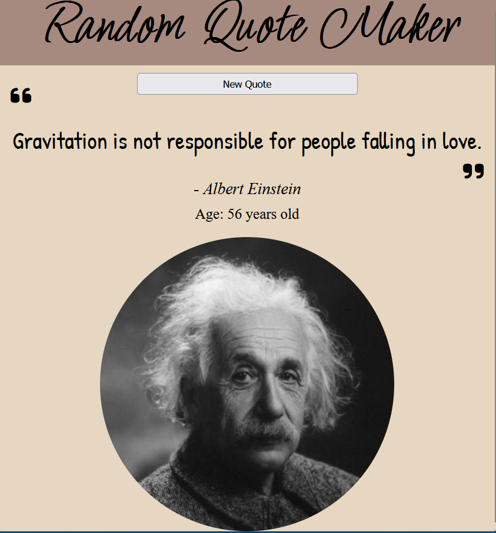

# Random quote maker

The goal of this project was to create a random quote maker using 2 API's and async / await .  
The first one gives you the quotes and the second one estimate the age of the author.  
It is very simple to use you only have to click on the *New Quote* button to display a new quote.

## Technology used

HTML, CSS, JavaScript

## Screen shot

